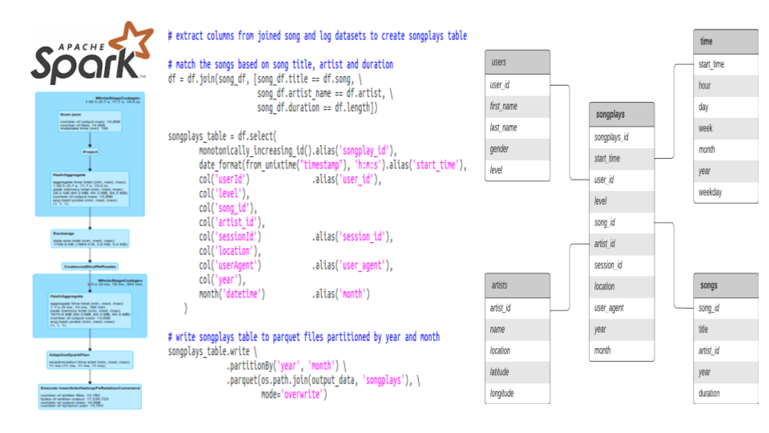
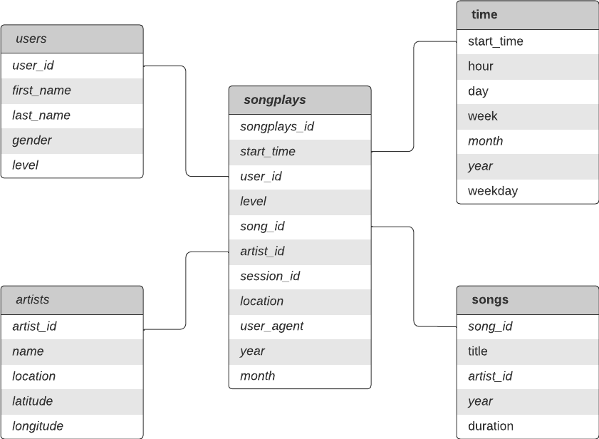

# Summary

- Sparkify startup requested to move song and log data into data lake.
- Extract, Transform and Load (ETL) pipeline extracts JSON data files from Amazon Simple Storage Service (S3) data storage and process them using Apache Spark on Amazon EMR, and loads the data back into a data lake hosted on S3 as partitioned Parquet files of  dimensional tables. 


# Data
Data for song and user activities reside in S3 as JSON files:
- Song data: s3://udacity-dend/song_data
- Log data: s3://udacity-dend/log_data
- Log data json path: s3://udacity-dend/log_json_path.json

## Song data 
- subset of real data from the [Million Song Dataset](http://millionsongdataset.com/).
- each file is in JSON format 
- contains metadata about a song and the artist of that song. 
- files are partitioned by the first three letters of each song's track ID. 
- example of file paths to two files in song dataset.

```
song_data/A/B/C/TRABCEI128F424C983.json
song_data/A/A/B/TRAABJL12903CDCF1A.json
```

- example of single song file, TRAABJL12903CDCF1A.json:

```
{"num_songs": 1, 
"artist_id": "ARJIE2Y1187B994AB7", 
"artist_latitude": null, 
"artist_longitude": null, 
"artist_location": "", 
"artist_name": "Line Renaud", 
"song_id": "SOUPIRU12A6D4FA1E1", 
"title": "Der Kleine Dompfaff", 
"duration": 152.92036, 
"year": 0}
```

## Log data 
- log files in JSON format generated by [event simulator](https://github.com/Interana/eventsim) based on the songs in the song dataset.
- these simulate activity logs from a music streaming app based on specified configurations.
- log files are partitioned by year and month. 
- example, here are filepaths to two files in log dataset.

```
log_data/2018/11/2018-11-12-events.json
log_data/2018/11/2018-11-13-events.json
```

- example of single log file, 2018-11-12-events.json:

```
{"artist":null,
"auth":"Logged In",
"firstName":"Celeste",
"gender":"F",
"itemInSession":0,
"lastName":"Williams",
"length":null,
"level":"free",
"location":"Klamath Falls, OR",
"method":"GET",
"page":"Home",
"registration":1541077528796.0,
"sessionId":438,
"song":null,
"status":200,
"ts":1541990217796,
"userAgent":"\"Mozilla\/5.0 (Windows NT 6.1; WOW64) AppleWebKit\/537.36 (KHTML, like Gecko) Chrome\/37.0.2062.103 Safari\/537.36\"",
"userId":"53"}
```


# Schema 
- Star schema that contains **1** fact table (**songplays**) and **4** dimension tables (**users**, **songs**, **artists** and **time**)



## Fact Table
### songplays
> records in log data associated with song plays i.e. records with page NextSong

| Column | Type |
| ------ | ----- |
| songplay_id | integer |
| start_time| timestamp|
| user_id| string|
| level| string |
| song_id| string |
| artist_id| string |
| session_id| integer |
| location| string |
| user_agent| string |
| year| integer |
| month| integer |

- partitioned by **year** and **month**.


## Dimension Tables

### users
> users in the app

| Column | Type |
| ------ | ----- |
| user_id | string|
| first_name| string|
| last_name| string|
| gender| string |
| level| string |


### songs 
> songs in music database

| Column | Type |
| ------ | ----- |
| song_id | string|
| title| string|
| artist_id| string|
| year| integer |
| duration| double|

- partitioned by: **year** and **artist_id**


### artists
> artists in music database

| Column | Type |
| ------ | ----- |
| artist_id | string|
| name| string |
| location| string |
| latitude| double| |
| longitude| double| |


### time 
> timestamps of records in songplays broken down into specific units

| Column | Type |
| ------ | ----- |
| start_time | timestamp|
| hour| integer |
| day| integer |
| week| integer |
| month| integer |
| year| integer |
| weekday| integer |

- partitioned by: **year** and **month**
   
# Project files

## etl.py 
- reads and processes files from S3
- loads data into the tables.

## dl.cfg
- configuration file for AWS credentials

```
[AWS]
AWS_ACCESS_KEY_ID=
AWS_SECRET_ACCESS_KEY=
```


# How to run the scripts:

- setup dl.cfg file

- launch EMR cluster

- connect to the cluster

- submit  _etl.py_ Spark script using YARN to process files and load data:

>    ``
   /usr/bin/spark-submit  --master yarn etl.py
    ``

# Data Engineering projects

- ## [Data Modeling with Postgres](https://github.com/aymanibrahim/data-modeling-postgres)
- ## [Data Modeling with Cassandra](https://github.com/aymanibrahim/data-modeling-cassandra)    
- ## [Data Warehouse with Redshift](https://github.com/aymanibrahim/data-warehouse-redshift)    
- ## [Data Lake with Spark](https://github.com/aymanibrahim/data-lake-spark)

- ## [Data Pipeline with Airflow](https://github.com/aymanibrahim/data-pipeline-airflow)